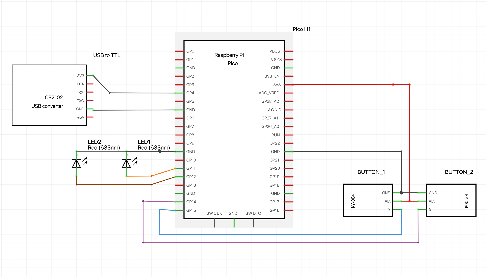

# PlayGate - Smart Door Opener for PlayStation Cabinet

## Overview

**PlayGate** is a smart door opener designed for a PlayStation 5 cabinet to ensure optimal ventilation and automate the process of opening and closing the cabinet door. The solution uses a **Raspberry Pi Pico** and a **Linear Actuator** to manage the door's movement based on the PlayStation's power state. Additional manual controls are also included for user convenience.

---

## How It Works

1. When the PlayStation 5 powers on, the USB port outputs power.
2. The **Raspberry Pi Pico** detects this power via the **USB to TTL converter UART module**.
3. The **Linear Actuator** is activated to open the cabinet door.
4. When the PlayStation 5 is turned off, the USB power is cut, and the **Linear Actuator** closes the cabinet door.
5. Manual buttons are available for overriding the automatic behavior, allowing manual control to open or close the door.

---

## Hardware List

The following hardware components are used in this project:

1. [Linear Actuator](https://www.aliexpress.us/item/3256806675629350.html)
2. [Relay Module](https://www.aliexpress.us/item/3256801509170031.html)
3. [USB to TTL converter UART module](https://www.aliexpress.us/item/3256806096688853.html)
4. [Raspberry Pi Pico](https://www.aliexpress.us/item/3256806123280687.html)
5. [Button Switches](https://www.aliexpress.us/item/3256806503141060.html)

---

## Toolset

To develop and design this project, the following tools are used:

- **Visual Studio Code**: For writing and uploading the C++ code to the Raspberry Pi Pico.
- **Raspberry Pi Pico Extension**: For integrating Pico development with Visual Studio Code [official documentation](https://github.com/raspberrypi/pico-sdk).
- **Fritzing**: For designing and visualizing the wiring diagram.

---

## Software Setup

### Prerequisites

1. Install **Visual Studio Code**.
2. Add the **Raspberry Pi Pico extension** for C++ development.